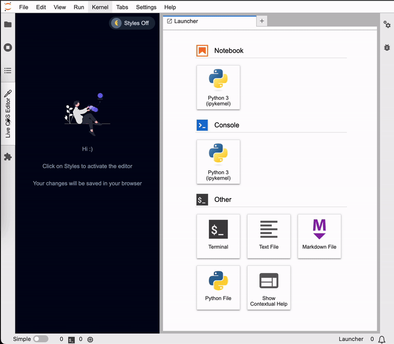

# technosec_jupyter_live_css_editor

A JupyterLab extension to style your extensions/applications easily & fast.



## Features
- Live review of your styles
- No waiting for webpack to compile your css changes to see effects
- Easy access to your design system colors: just click to copy into clipboard
- Automatically saved in your local storage
- One click to download all your styles in zip as a backup
- Multi stylesheet editing
- VSCode's Monaco editor: shortcuts, command palette, zoom in/out, code formatting, syntax highlighting, auto complete

## Install

```bash
jlpm
jlpm build
jupyter labextension install .

# Rebuild Typescript source after making changes
jlpm build
# Rebuild JupyterLab after making any changes
jupyter lab build
```

You can watch the source directory and run JupyterLab in watch mode to watch for changes in the extension's source and automatically rebuild the extension and application.

```bash
# Watch the source directory in another terminal tab
jlpm watch
# Run jupyterlab in watch mode in one terminal tab
jupyter lab --watch
```
